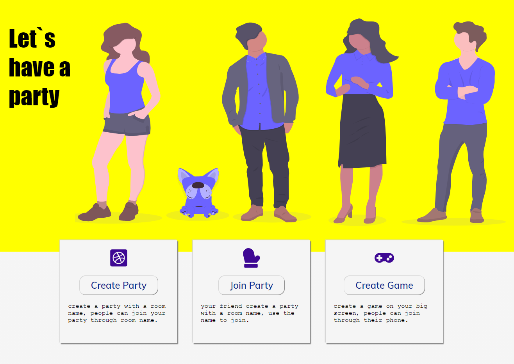
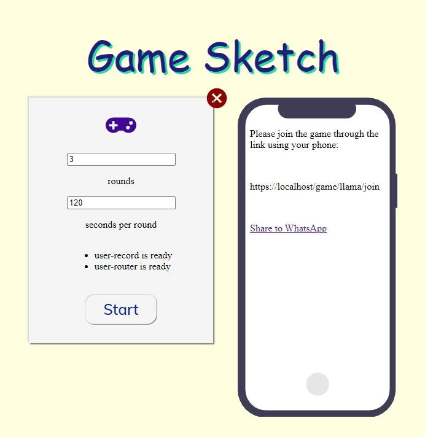
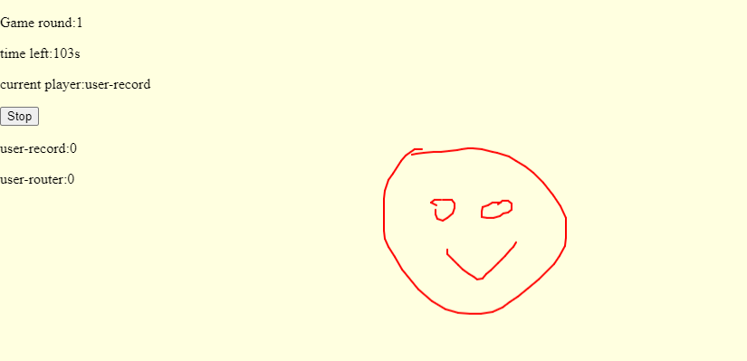
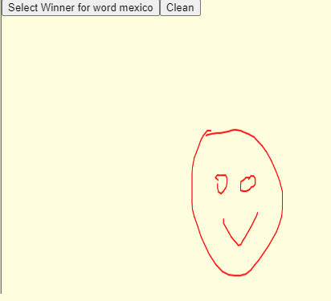
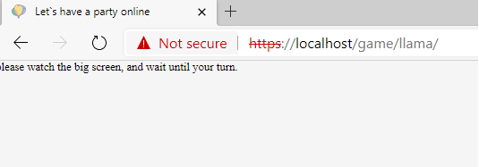
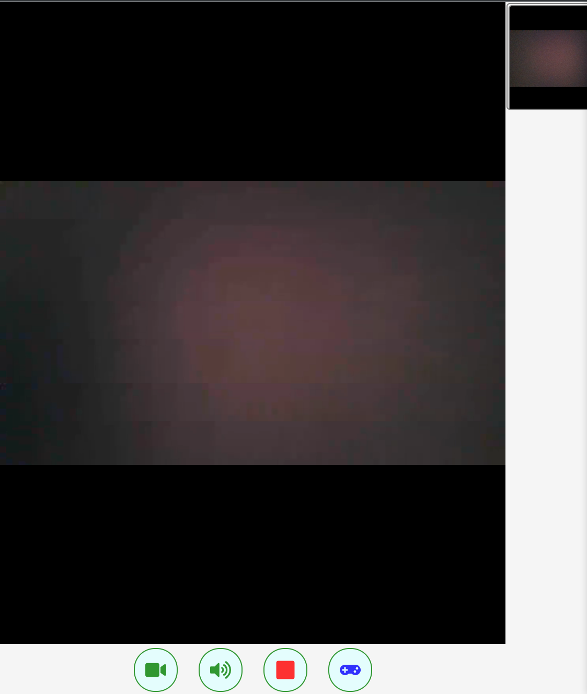
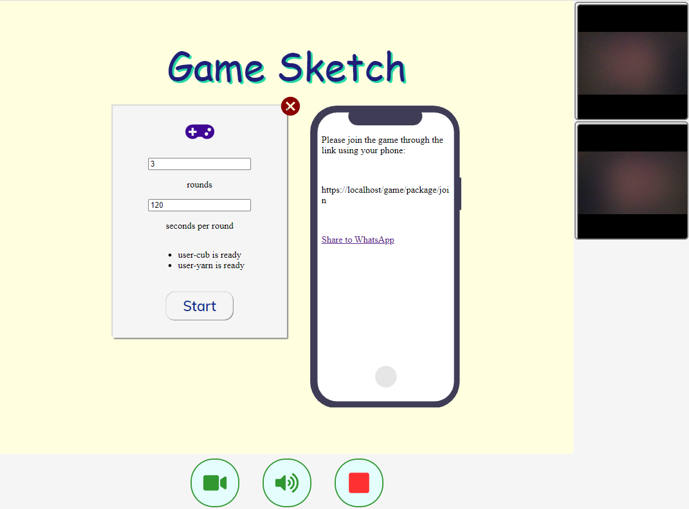

# Party Video Game

## 项目介绍

- 在聚会中，常常因为是刚认识的原因，或者不善聊天，我们需要一些游戏来促进一些话题，但一个可玩的桌游动辄几十刀，便宜的游戏又缺乏可玩性。
- 实体桌游的玩法特别有限，多数为卡牌类，游戏一旦复杂，光整理游戏的时间就要占去一大半。
- 病毒将长期与我们共存，需要有新的形式来促进我们的沟通，而不是 20 人 Zoom 里大家相互 Mute.

项目主要针对这些痛点做的一个解决方案Demo。

## 开发环境介绍
- react, typescript
- agora
- google firebase
- docker

## 项目本地启动
- 安装 docker, docker-compose
- win环境下 `.\start.ps1`
    * 其他环境可以直接尝试脚本中的命令

- 浏览器： https://localhost

## 项目预览
 - 欢迎

   

 - 开始游戏

    
 
 - 游戏中

    

 - 视频+游戏

    

## 作者
* Ming bryht@live.com