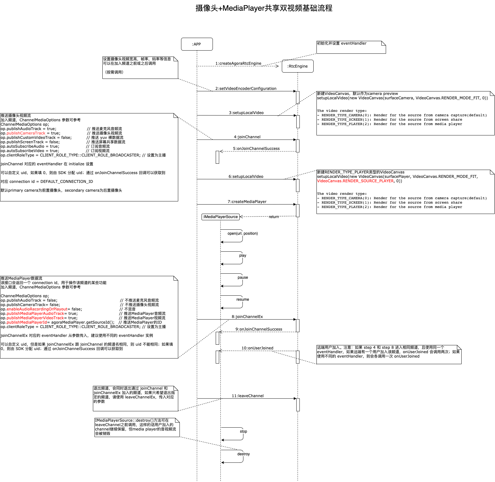
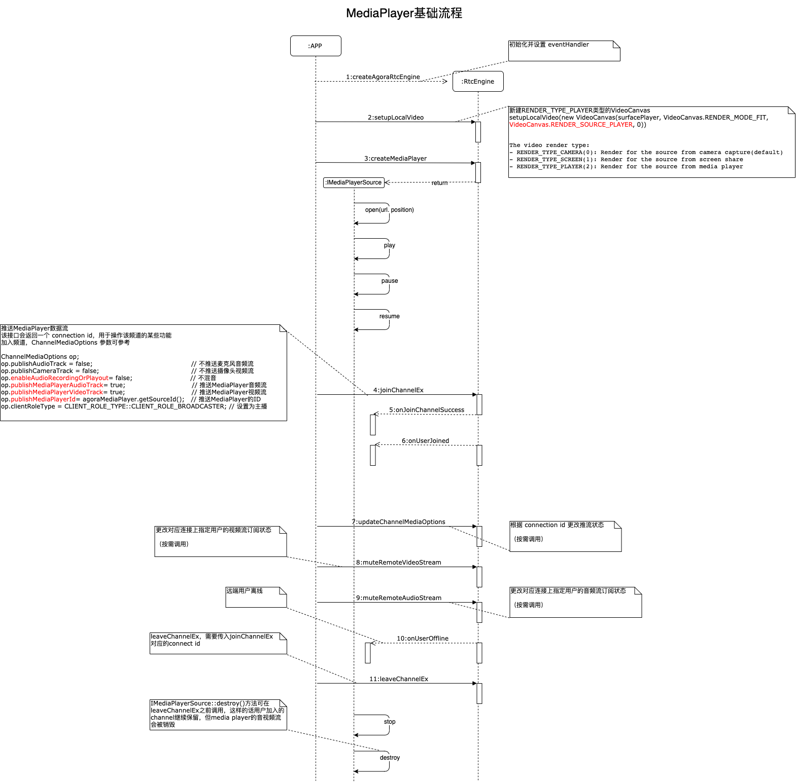
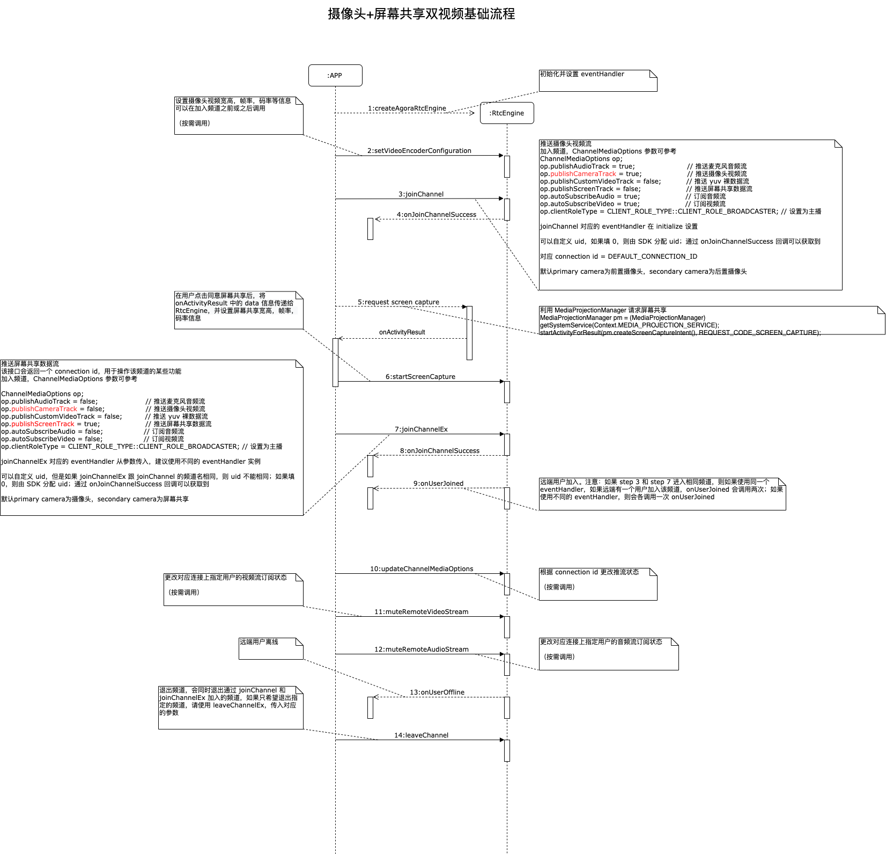
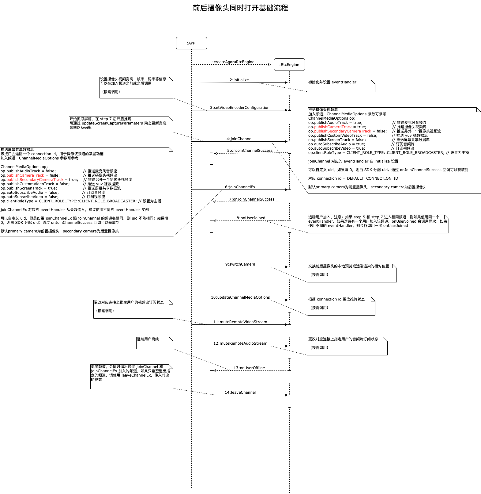
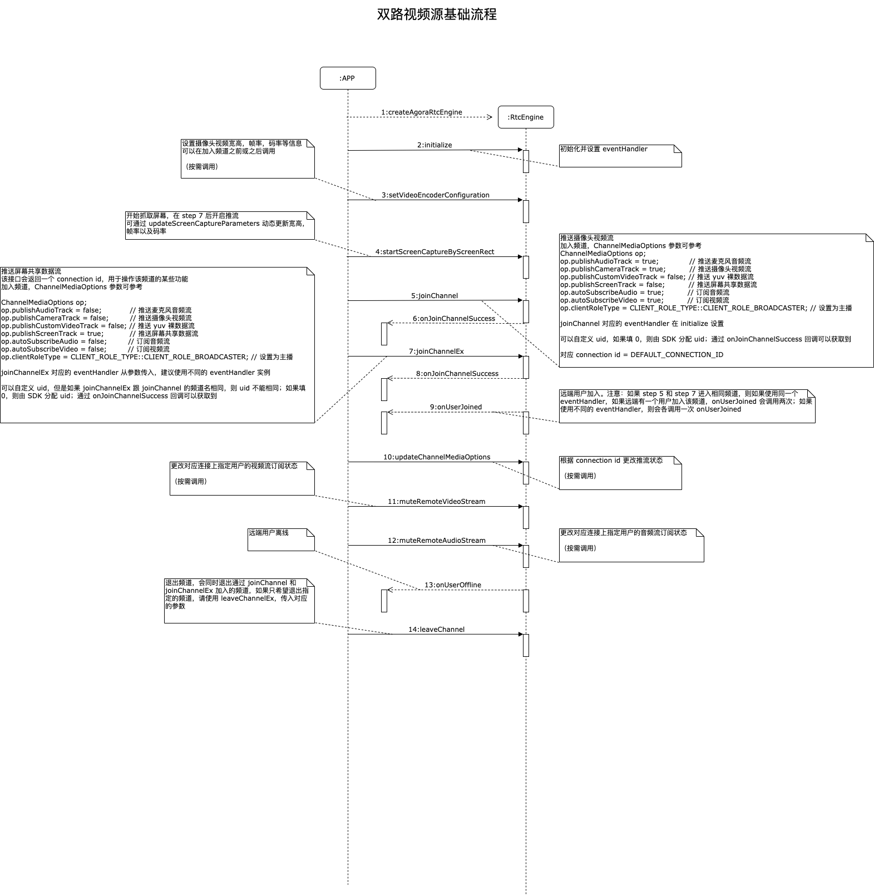
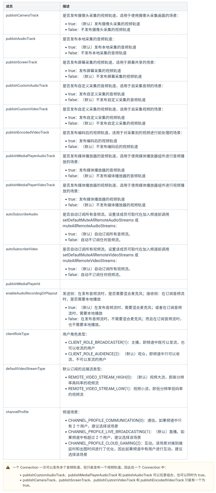
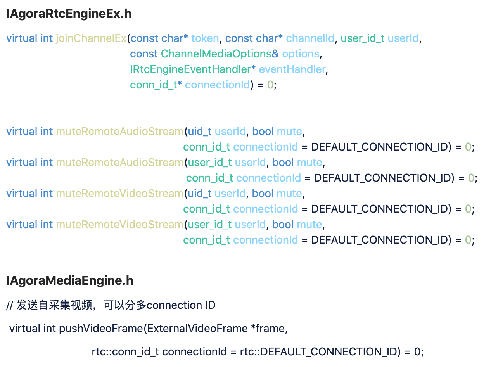

# 大赛特殊版 SDK

本次秋季赛，除了原本声网发布在官网的 SDK，我们提供拥有更多场景结合能力的「特别版SDK」，基于这个 SDK，你还可以与 Go Pro 等硬件结合，玩转更多有趣的场景。使用「特别版 SDK」由于开发难度较大，因此我们会给相应的作品一定程度的加分。

## SDK 下载

[点击下载 Android](http://10.80.1.174:8090/agora_sdk/android/2020-07-27/Agora_Native_SDK_for_Android_admin_2761_ffmpeg_player_20200727_2231.zip)

[点击下载 iOS](http://10.80.1.174:8090/agora_sdk/ios/2020-07-28/Agora_Native_SDK_for_iOS_special_21085_20200728_1157.zip)

[点击下载 Windows](http://10.80.1.174:8090/agora_sdk/windows/2020-07-26/x86/Agora_Native_SDK_for_Windows_x86_admin_25414_ffmpeg_player_20200726_2255.zip)

## 功能 & 性能 亮点
### 加强频道管理  - 多频道，多视频流 - 新增和修改接口说明
* 支持多次进入相同频道（用ConnectionId标示，用于发送多流进入相同频道）
* 支持进入不同频道用于订阅不同频道的流
* 增加频道媒体选项 - 频道媒体选项
### 支持多路媒体流
* 支持发布多条外部视频流进入 “相同” / “不同” 频道  
* 支持发布多路外部音频PCM 流进入 相同“/”不同“的频道 
* 支持外部音频流和本地音频流自动混音 
* Windows 支持同时屏幕共享和摄像头采集 - Windows同时共享桌面和摄像头
### 性能优化
* Android 支持全链路硬件加速，相同profile，如720P30 system CPU 节省40%，app CPU 节省60%， 性能提升一倍
* Windows 不需要用多进程支持多路视频源，在相同场景下，节省CPU 30%+
* Windows 支持至少4KP30 的播放，支持Intel，NVIDIA 硬编，性能有大幅提升
* 全平台支持1080P60 播放
* 新增CHANNEL_PROFILE_CLOUD_GAMING，端到端延迟低至20ms，适合于超低延迟场景，如云游戏
* 新增 CHANNEL_PROFILE_COMMUNICATION_1v1，在1v1场景下，优化弱网下的卡顿率，平均延迟小于200ms。
### Technical Preview功能
* Windows + Android： 支持内置Media Player ，不再需要独立组件  （功能是全平台，API目前只有windows端，需要一天时间增加移动端接口），无论是包体积还是性能都有大幅优化
* Android： 支持内置的屏幕共享功能
* iOS：支持前后摄像头同时打开，并进入频道

## 调用序列参考

### Android Media Player




***

### Android 屏幕共享




```
public class LiveActivity extends AppCompatActivity {
 
    private RtcEngine mRtcEngine;
    private IRtcEngineEventHandler eventHandler;
    private static final int REQUEST_CODE_SCREEN_CAPTURE = 101;
 
    @Override
    protected void onCreate(Bundle savedInstanceState) {
        super.onCreate(savedInstanceState);
        // ...
        try {
            mRtcEngine = RtcEngine.create(getApplicationContext(), getString(R.string.private_app_id), eventHandler);
            configVideo();
        } catch (Exception e) {
            e.printStackTrace();
        }
    }
 
    public void askForScreenShare() {
        if (android.os.Build.VERSION.SDK_INT >= android.os.Build.VERSION_CODES.LOLLIPOP) {
            MediaProjectionManager pm = (MediaProjectionManager) getSystemService(Context.MEDIA_PROJECTION_SERVICE);
            startActivityForResult(pm.createScreenCaptureIntent(), REQUEST_CODE_SCREEN_CAPTURE);
        }
    }
 
    @Override
    protected void onActivityResult(int requestCode, int resultCode, @Nullable Intent data) {
        if (requestCode == REQUEST_CODE_SCREEN_CAPTURE && resultCode == RESULT_OK) {
            DisplayMetrics displayMetrics = new DisplayMetrics();
            getWindowManager().getDefaultDisplay().getMetrics(displayMetrics);
 
            ScreenCaptureParameters screenCaptureParameters = new ScreenCaptureParameters();
            screenCaptureParameters.setVideoDimensions(new VideoEncoderConfiguration.VideoDimensions(displayMetrics.widthPixels, displayMetrics.heightPixels));
            screenCaptureParameters.setBitrate(4850);
            screenCaptureParameters.setFrameRate(60);
            mRtcEngine.startScreenCapture(data, screenCaptureParameters);
            joinChannel();
        }
    }
    private void configVideo() {
        // ...
    }
 
    private void joinChannel() {
        // ...
    }
}
```

**Notice:**

According to [Restricted access to screen contents](https://developer.android.google.cn/about/versions/10/privacy/changes#screen-contents), From Android 10 and later, a Service must be running and call startForeground to post a Notification before we can obtain the MediaProjection instance; failing to do so will cause a SecurityException.

***

### iOS支持前后摄像头同时打开，并进入频道



***

### Windows 同时共享桌面和摄像头



***

### 多频道 & 频道媒体选项

#### 设计背景

新的JoinChannel API设计希望能够：

1. 明确joinChannel的时候，对于发布和订阅流有更清晰的控制，比如选择是否发布camera 或者screen 视频流，是否要主动订阅远端用户的音视频流。
2. 当前架构中，一个channel中的一个用户uid，只能发布一路视频流。为了我们可以在一个频道中发多路视频流，我们提供了joinChannel 多次的能力，你可以作为不同的用户多次进入一个频道，每一个用户可以独立控制一路视频流，通过ConnectinId来区分。

#### API 描述

为方便开发者对频道进行更精细的管理，大重构 SDK 在 joinChannel、joinChannelEx 方法中提供了一个 ChannelMediaOptions 结构体，方便你在加入频道前，对媒体流进行一些默认设置。加入频道后，你也可以通过 updateChannelMediaOptions 方法来更新在该结构体中的设置。

ChannelMediaOptions 结构体定义如下：

```
struct ChannelMediaOptions {
  base::Optional<bool> publishCameraTrack;
  base::Optional<bool> publishAudioTrack;
  base::Optional<bool> publishScreenTrack;
  base::Optional<bool> publishCustomAudioTrack;
  base::Optional<bool> publishCustomVideoTrack;
  base::Optional<bool> publishEncodedVideoTrack;
  base::Optional<bool> publishMediaPlayerAudioTrack;
  base::Optional<bool> publishMediaPlayerVideoTrack;
  base::Optional<bool> autoSubscribeAudio;
  base::Optional<bool> autoSubscribeVideo;
  base::Optional<int> publishMediaPlayerId;
  base::Optional<bool> enableAudioRecordingOrPlayout;
  base::Optional<CLIENT_ROLE_TYPE> clientRoleType;
  base::Optional<REMOTE_VIDEO_STREAM_TYPE> defaultVideoStreamType;
  base::Optional<CHANNEL_PROFILE_TYPE> channelProfile;
}
```


***

### 多频道，多视频流 - 新增和修改接口说明

#### API 整体说明

* 新增和修改的API 是为了多频道，保持原有API对于 default channel 主频道 行为不变
* 原JoinChannel为主频道，只能调用一次
* joinChannelEx/leaveChannelEx 可以进去额外频道，可以调用多次
* channel Id 为频道名，因为需要支持进入相同频道名多次，新增connectionId 作为标识
* ConnectionId 主频道可以用DEFAULT_CHANNEL_ID（0）也可以省略不填,  其他频道的connectionId， 是在joinChannelEx中获得的, 用于针对频道的一些操作，如:
  * 订阅/取消订阅用户的视频流
  * 订阅/取消订阅用户的音频流
  * 设置远端用户的渲染窗口（ivreal不需要）

#### 关于多频道接口说明

