# 智电运维
## 1.项目介绍
   该项目主要为电力行业设备巡检的一个解决方案，主要解决电力行业职工，对所属公司的电力设备进行巡检维护难，设备状态标记复杂，人员管理较弱，问题解决沟通成本较大且效率低的问题，等一些痛点问题，故进行了该项目的开发。致力于帮助电力用户高效的进行设备巡检工作，快捷方便的进行协作沟通。

## 2.项目模块介绍
  项目主要分为三大模块，设备模块，统计模块，个人中心。
## 3.项目特色
 项目中声网的实时消息和1对1视频通话，解决外勤人员与技术专家及远程协助的痛点问题，能够在业务及工作中真正解决实际问题，结合实际工作需求，进行项目构思尝试。
### 3.1可视化展示设备的地图分布及设备状态标记，支持设备位置导航
  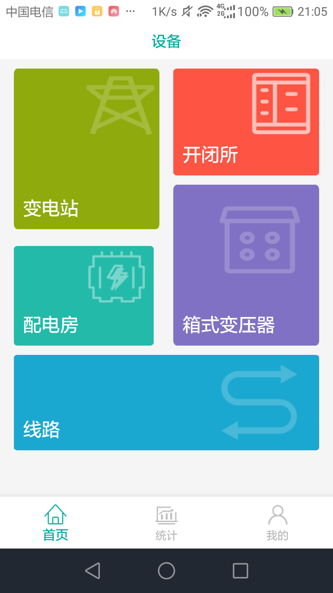

### 3.2问题沟通提供多种方案进行有效沟通，手机号拨打，在线聊天，及视频直连功能
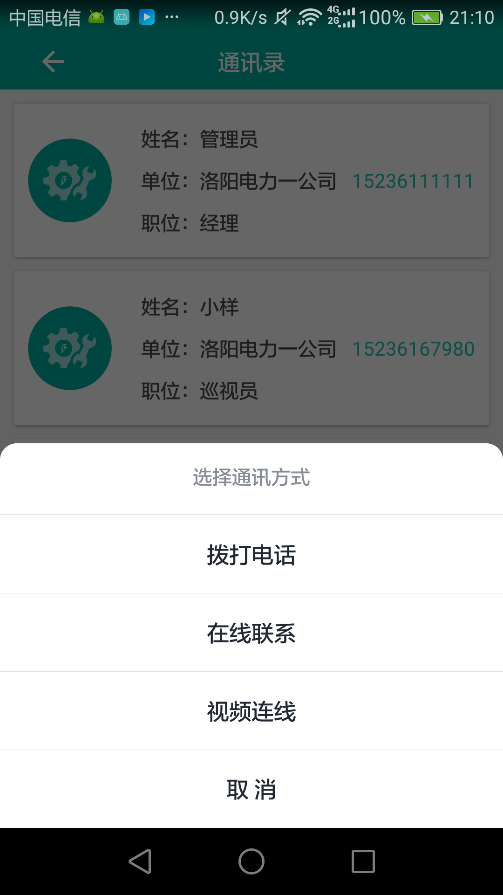

### 3.3 设备数据及人员数据的统计功能
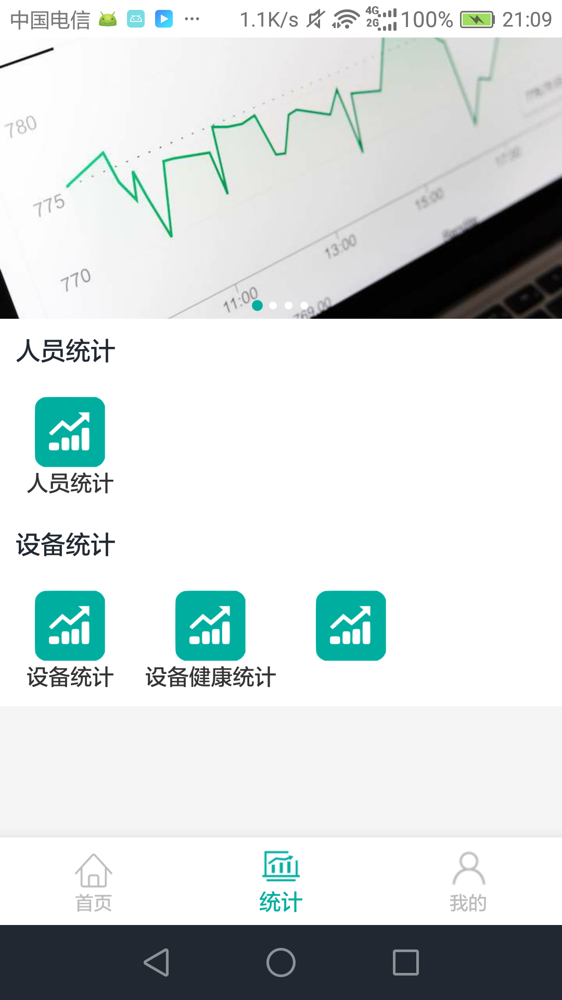  |    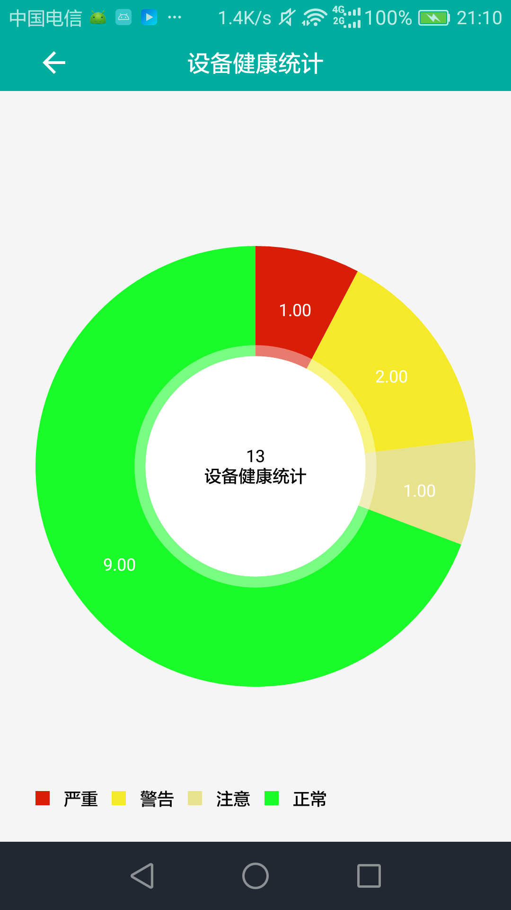

### 3.4 设备数据的点位标记和状态区分
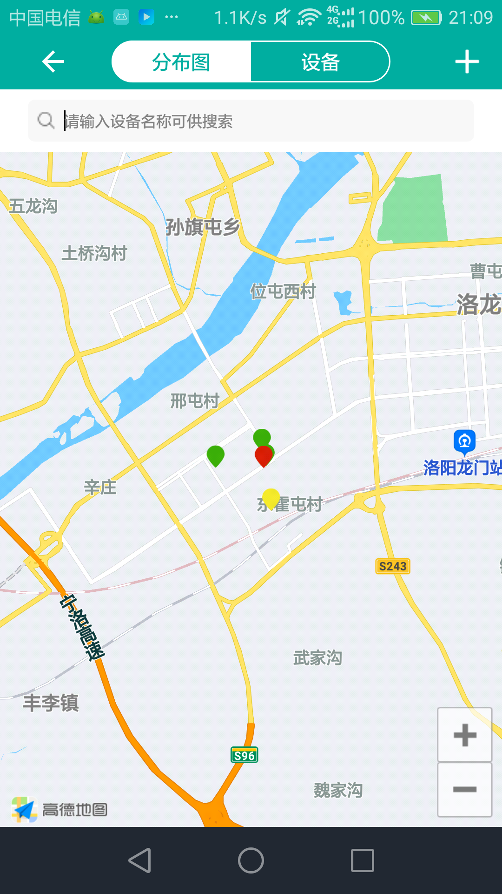     |   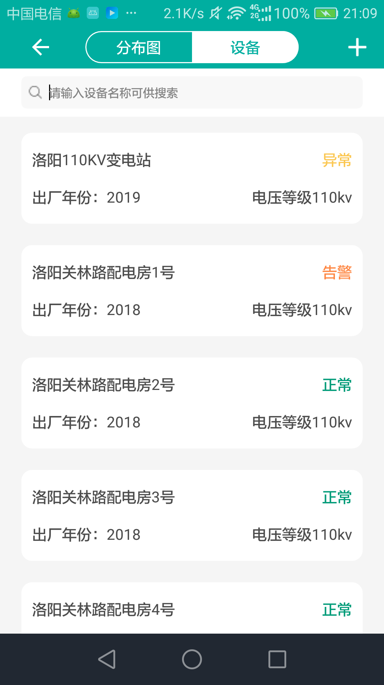

### 3.4 支持与服务
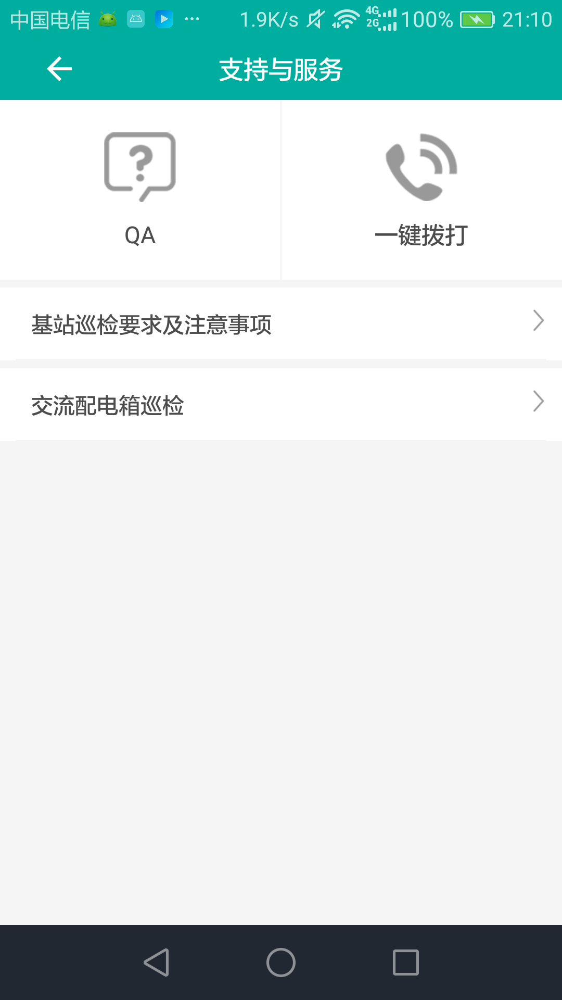     |   

### 3.5 其他视图预览
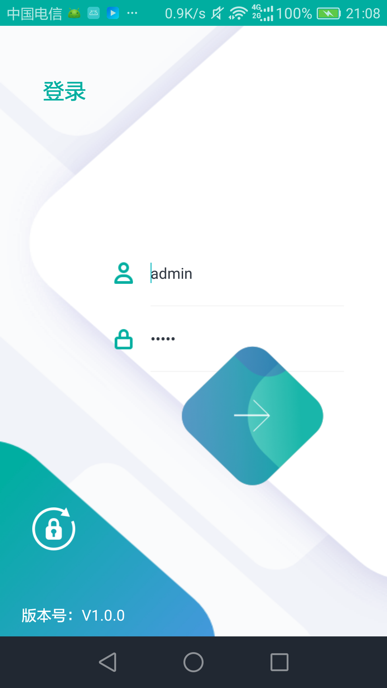  |  | 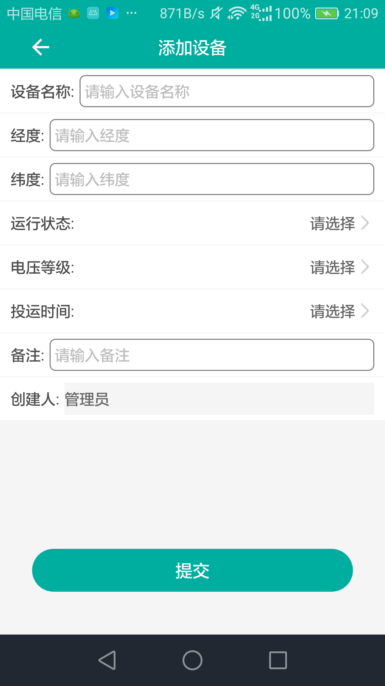
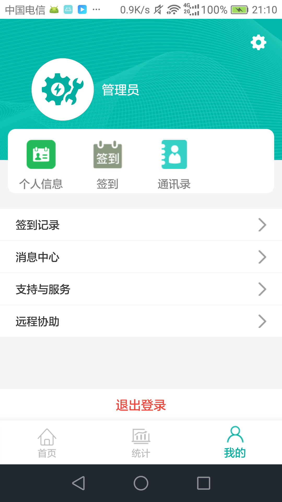  | 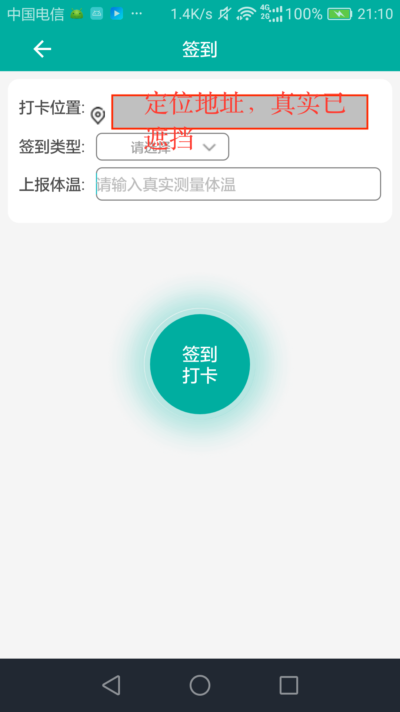
# 4.说明
声网id在项目中已清除，具体设置位置可在data/Constants 下设置AGORA_APP_ID 和AGORA_ACCESS_TOKEN

# 5.团队介绍
团队名：谨行锦远

开发，兼设计，兼数据结构等：xiaoyang

联系方式：446085736@qq.com

